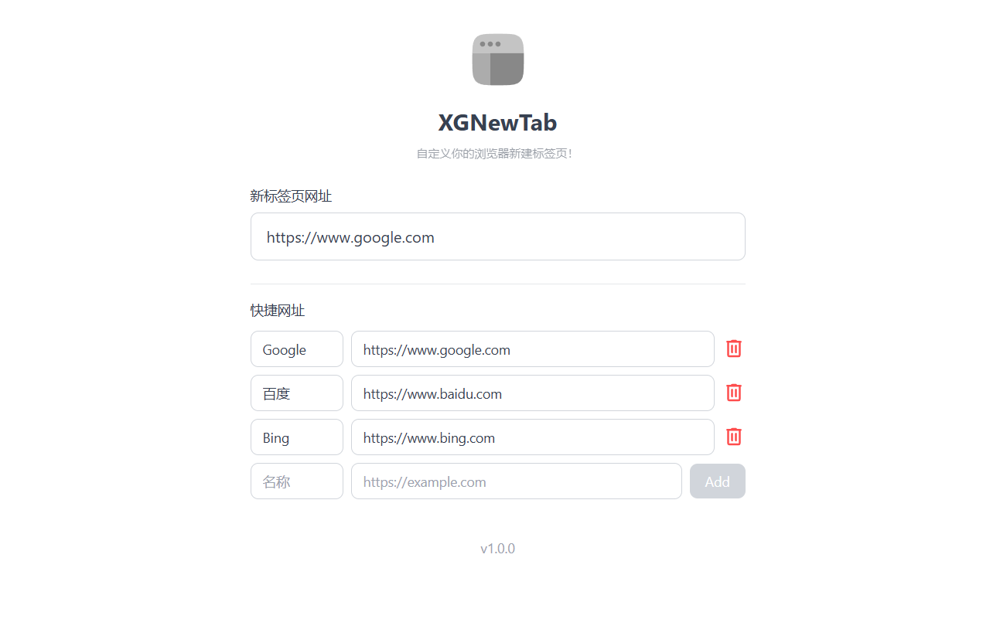

<div align="center">
  
  <h1>XGNewTab</h1>
  <p>自定义浏览器新标签页</p>

  <p>
    <a href="./README.md">English</a> | 简体中文 | <a href="./README-cmn_TW.md">繁體中文</a> | <a href="./README-jyut.md">粵語</a>
  </p>
</div>

---

## 介绍

XGNewTab 是一个简单的浏览器扩展，让你可以自定义新标签页。当你打开新标签页时，它会自动跳转到你指定的网址。

<!-- 截图 -->
<div align="center">
  
</div>

## 功能特点

- 将任意网址设为新标签页
- 即时跳转，无闪烁
- 简洁清爽的界面
- 自动保存设置
- 网址格式验证

## 安装

### Chrome 应用商店

<!-- TODO: 添加 Chrome 应用商店链接 -->
即将上线...

### Edge 扩展商店

<!-- TODO: 添加 Edge 扩展商店链接 -->
即将上线...

### 手动安装

1. 从 [Releases](https://github.com/XXGGG/XGNewTab/releases) 下载最新版本
2. 解压下载的文件
3. 打开 Chrome，进入 `chrome://extensions/`
4. 在右上角启用「开发者模式」
5. 点击「加载已解压的扩展程序」，选择解压后的文件夹

## 使用方法

1. 点击浏览器工具栏中的 XGNewTab 图标
2. 输入你想要的网址（例如：`https://google.com`）
3. 网址会自动保存
4. 打开新标签页查看效果

## 从源码构建

```bash
# 安装依赖
pnpm install

# 开发模式
pnpm dev

# 生产构建
pnpm build

# 打包为 zip
pnpm pack:zip
```

## 许可证

MIT License

## 作者

[XXGGG](https://github.com/XXGGG)
